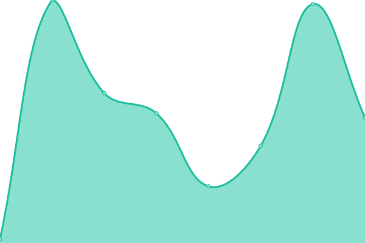
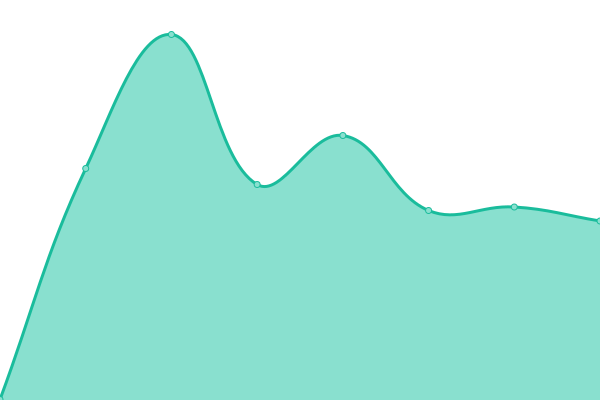
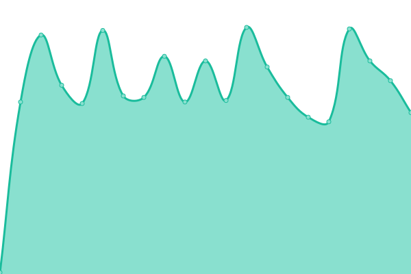
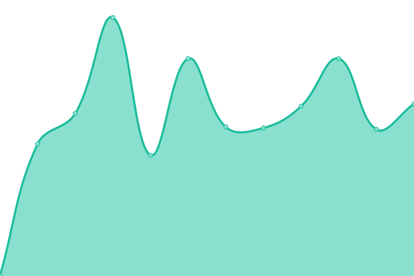
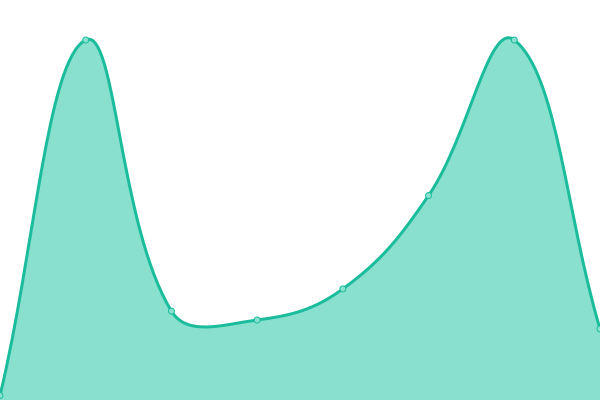

# [📈 Live Status](https://status3.mk16.de): <!--live status--> **🟧 Partial outage**

This repository contains the open-source uptime monitor and status page for [Marek Küthe](https://mk16.de/), powered by [Upptime](https://github.com/upptime/upptime).

With [Upptime](https://upptime.js.org), you can get your own unlimited and free uptime monitor and status page, powered entirely by a GitHub repository. We use [Issues](https://github.com/marek22k/uptime/issues) as incident reports, [Actions](https://github.com/marek22k/uptime/actions) as uptime monitors, and [Pages](https://status3.mk16.de) for the status page.

<!--start: status pages-->
<!-- This summary is generated by Upptime (https://github.com/upptime/upptime) -->
<!-- Do not edit this manually, your changes will be overwritten -->
<!-- prettier-ignore -->
| URL | Status | History | Response Time | Uptime |
| --- | ------ | ------- | ------------- | ------ |
|  [p2p-node.de SSH](p2p-node.de) | 🟩 Up | [p2p-node-de-ssh.yml](https://github.com/marek22k/uptime/commits/HEAD/history/p2p-node-de-ssh.yml) | 

 125ms
     
 | 

<a href="https://status3.mk16.de/history/p2p-node-de-ssh">100.00%</a>
    

|  [p2p-router.de SSH](p2p-router.de) | 🟩 Up | [p2p-router-de-ssh.yml](https://github.com/marek22k/uptime/commits/HEAD/history/p2p-router-de-ssh.yml) | 

 119ms
     
 | 

<a href="https://status3.mk16.de/history/p2p-router-de-ssh">100.00%</a>
    

|  [herzstein.mk16.de SSH](herzstein.mk16.de) | 🟩 Up | [herzstein-mk16-de-ssh.yml](https://github.com/marek22k/uptime/commits/HEAD/history/herzstein-mk16-de-ssh.yml) | 

 177ms
     
 | 

<a href="https://status3.mk16.de/history/herzstein-mk16-de-ssh">100.00%</a>
    

|  [aurora.mk16.de SSH](aurora.mk16.de) | 🟩 Up | [aurora-mk16-de-ssh.yml](https://github.com/marek22k/uptime/commits/HEAD/history/aurora-mk16-de-ssh.yml) | 

 39ms
     
 | 

<a href="https://status3.mk16.de/history/aurora-mk16-de-ssh">99.77%</a>
    

|  [palerme.mk16.de SSH](palerme.mk16.de) | 🟥 Down | [palerme-mk16-de-ssh.yml](https://github.com/marek22k/uptime/commits/HEAD/history/palerme-mk16-de-ssh.yml) | 

 0ms
     
 | 

<a href="https://status3.mk16.de/history/palerme-mk16-de-ssh">100.00%</a>
    

|  [silvermoon.mk16.de SSH](silvermoon.mk16.de) | 🟩 Up | [silvermoon-mk16-de-ssh.yml](https://github.com/marek22k/uptime/commits/HEAD/history/silvermoon-mk16-de-ssh.yml) | 

 130ms
     
 | 

<a href="https://status3.mk16.de/history/silvermoon-mk16-de-ssh">100.00%</a>
    

|  [laplace.mk16.de SSH](laplace.mk16.de) | 🟥 Down | [laplace-mk16-de-ssh.yml](https://github.com/marek22k/uptime/commits/HEAD/history/laplace-mk16-de-ssh.yml) | 

 0ms
     
 | 

<a href="https://status3.mk16.de/history/laplace-mk16-de-ssh">100.00%</a>
    

|  [stricker.mk16.de SSH](stricker.mk16.de) | 🟥 Down | [stricker-mk16-de-ssh.yml](https://github.com/marek22k/uptime/commits/HEAD/history/stricker-mk16-de-ssh.yml) | 

 46ms
     
 | 

<a href="https://status3.mk16.de/history/stricker-mk16-de-ssh">0.00%</a>
    

|  [trolljaeger.mk16.de SSH](trolljaeger.mk16.de) | 🟩 Up | [trolljaeger-mk16-de-ssh.yml](https://github.com/marek22k/uptime/commits/HEAD/history/trolljaeger-mk16-de-ssh.yml) | 

 32ms
     
 | 

<a href="https://status3.mk16.de/history/trolljaeger-mk16-de-ssh">100.00%</a>
    

|  [frostwood.mk16.de SSH](frostwood.mk16.de) | 🟩 Up | [frostwood-mk16-de-ssh.yml](https://github.com/marek22k/uptime/commits/HEAD/history/frostwood-mk16-de-ssh.yml) | 

 124ms
     
 | 

<a href="https://status3.mk16.de/history/frostwood-mk16-de-ssh">100.00%</a>
    

|  [srv.dn42-lab.de SSH](srv.dn42-lab.de) | 🟩 Up | [srv-dn42-lab-de-ssh.yml](https://github.com/marek22k/uptime/commits/HEAD/history/srv-dn42-lab-de-ssh.yml) | 

 125ms
     
 | 

<a href="https://status3.mk16.de/history/srv-dn42-lab-de-ssh">100.00%</a>
    

|  [reseau.mk16.de SSH](reseau.mk16.de) | 🟥 Down | [reseau-mk16-de-ssh.yml](https://github.com/marek22k/uptime/commits/HEAD/history/reseau-mk16-de-ssh.yml) | 

 0ms
     
 | 

<a href="https://status3.mk16.de/history/reseau-mk16-de-ssh">100.00%</a>
    

|  [grisha.mk16.de SSH](grisha.mk16.de) | 🟥 Down | [grisha-mk16-de-ssh.yml](https://github.com/marek22k/uptime/commits/HEAD/history/grisha-mk16-de-ssh.yml) | 

 0ms
     
 | 

<a href="https://status3.mk16.de/history/grisha-mk16-de-ssh">100.00%</a>
    

|  [mikhail.mk16.de SSH](mikhail.mk16.de) | 🟥 Down | [mikhail-mk16-de-ssh.yml](https://github.com/marek22k/uptime/commits/HEAD/history/mikhail-mk16-de-ssh.yml) | 

 0ms
     
 | 

<a href="https://status3.mk16.de/history/mikhail-mk16-de-ssh">100.00%</a>
    

|  [reseau.mk16.de (Looking Glass)](http://lg.reseau.mk16.de/) | 🟥 Down | [reseau-mk16-de-looking-glass.yml](https://github.com/marek22k/uptime/commits/HEAD/history/reseau-mk16-de-looking-glass.yml) | 

 0ms
     
 | 

<a href="https://status3.mk16.de/history/reseau-mk16-de-looking-glass">100.00%</a>
    

|  [p2p-router.de I2P reseed server](https://www2.mk16.de/) | 🟩 Up | [p2p-router-de-i2-p-reseed-server.yml](https://github.com/marek22k/uptime/commits/HEAD/history/p2p-router-de-i2-p-reseed-server.yml) | 

 482ms
     
 | 

<a href="https://status3.mk16.de/history/p2p-router-de-i2-p-reseed-server">100.00%</a>
    

|  [p2p-router.de I2P reseed server (seed file)](https://www2.mk16.de/i2pseeds.su3) | 🟩 Up | [p2p-router-de-i2-p-reseed-server-seed-file.yml](https://github.com/marek22k/uptime/commits/HEAD/history/p2p-router-de-i2-p-reseed-server-seed-file.yml) | 

 341ms
     
 | 

<a href="https://status3.mk16.de/history/p2p-router-de-i2-p-reseed-server-seed-file">99.83%</a>
    

|  [Website i2phides.me](https://i2phides.me/) | 🟩 Up | [website-i2phides-me.yml](https://github.com/marek22k/uptime/commits/HEAD/history/website-i2phides-me.yml) | 

 674ms
     
 | 

<a href="https://status3.mk16.de/history/website-i2phides-me">100.00%</a>
    

|  [I2P inproxy](https://proxy.i2phides.me/) | 🟥 Down | [i2-p-inproxy.yml](https://github.com/marek22k/uptime/commits/HEAD/history/i2-p-inproxy.yml) | 

 0ms
     
 | 

<a href="https://status3.mk16.de/history/i2-p-inproxy">100.00%</a>
    

|  [Website mk16.de](https://mk16.de/) | 🟩 Up | [website-mk16-de.yml](https://github.com/marek22k/uptime/commits/HEAD/history/website-mk16-de.yml) | 

 671ms
     
 | 

<a href="https://status3.mk16.de/history/website-mk16-de">100.00%</a>
    

|  [Website bandura-comm.mk16.de](https://bandura-comm.mk16.de/) | 🟥 Down | [website-bandura-comm-mk16-de.yml](https://github.com/marek22k/uptime/commits/HEAD/history/website-bandura-comm-mk16-de.yml) | 

 570ms
     
 | 

<a href="https://status3.mk16.de/history/website-bandura-comm-mk16-de">30.09%</a>
    

|  [Website crxn.de](https://crxn.de/) | 🟩 Up | [website-crxn-de.yml](https://github.com/marek22k/uptime/commits/HEAD/history/website-crxn-de.yml) | 

 772ms
     
 | 

<a href="https://status3.mk16.de/history/website-crxn-de">100.00%</a>
    

|  [BgpLookup](https://dn42-bgplookup.mk16.de/) | 🟩 Up | [bgp-lookup.yml](https://github.com/marek22k/uptime/commits/HEAD/history/bgp-lookup.yml) | 

 576ms
     
 | 

<a href="https://status3.mk16.de/history/bgp-lookup">100.00%</a>
    

|  [BgpLookup data actuality](https://dn42-bgplookup.mk16.de/about) | 🟩 Up | [bgp-lookup-data-actuality.yml](https://github.com/marek22k/uptime/commits/HEAD/history/bgp-lookup-data-actuality.yml) | 

 131ms
     
 | 

<a href="https://status3.mk16.de/history/bgp-lookup-data-actuality">88.75%</a>
    

|  [auth.mk16.de Authelia](https://auth.mk16.de/) | 🟩 Up | [auth-mk16-de-authelia.yml](https://github.com/marek22k/uptime/commits/HEAD/history/auth-mk16-de-authelia.yml) | 

 623ms
     
 | 

<a href="https://status3.mk16.de/history/auth-mk16-de-authelia">100.00%</a>
    

|  [mk16.de E-Mail (Netcup)](mxe87b.netcup.net) | 🟩 Up | [mk16-de-e-mail-netcup.yml](https://github.com/marek22k/uptime/commits/HEAD/history/mk16-de-e-mail-netcup.yml) | 

 124ms
     
 | 

<a href="https://status3.mk16.de/history/mk16-de-e-mail-netcup">100.00%</a>
    

|  [n1.mk16.de DNS](n1.mk16.de) | 🟩 Up | [n1-mk16-de-dns.yml](https://github.com/marek22k/uptime/commits/HEAD/history/n1-mk16-de-dns.yml) | 

 125ms
     
 | 

<a href="https://status3.mk16.de/history/n1-mk16-de-dns">100.00%</a>
    

|  [n2.mk16.de DNS](n2.mk16.de) | 🟩 Up | [n2-mk16-de-dns.yml](https://github.com/marek22k/uptime/commits/HEAD/history/n2-mk16-de-dns.yml) | 

 119ms
     
 | 

<a href="https://status3.mk16.de/history/n2-mk16-de-dns">100.00%</a>
    

|  [n3.mk16.de DNS](n3.mk16.de) | 🟩 Up | [n3-mk16-de-dns.yml](https://github.com/marek22k/uptime/commits/HEAD/history/n3-mk16-de-dns.yml) | 

 177ms
     
 | 

<a href="https://status3.mk16.de/history/n3-mk16-de-dns">100.00%</a>
    

|  [n4.mk16.de DNS](n4.mk16.de) | 🟥 Down | [n4-mk16-de-dns.yml](https://github.com/marek22k/uptime/commits/HEAD/history/n4-mk16-de-dns.yml) | 

 46ms
     
 | 

<a href="https://status3.mk16.de/history/n4-mk16-de-dns">99.99%</a>
    

|  [n5.mk16.de DNS](n5.mk16.de) | 🟩 Up | [n5-mk16-de-dns.yml](https://github.com/marek22k/uptime/commits/HEAD/history/n5-mk16-de-dns.yml) | 

 221ms
     
 | 

<a href="https://status3.mk16.de/history/n5-mk16-de-dns">100.00%</a>
    

<!--end: status pages-->

[**Visit our status website →**](https://status3.mk16.de)

## 📄 License

- Powered by: [Upptime](https://github.com/upptime/upptime)
- Code: [MIT](./LICENSE) © [Anand Chowdhary](https://anandchowdhary.com), supported by [Pabio](https://pabio.com)
- Data in the `./history` directory: [Open Database License](https://opendatacommons.org/licenses/odbl/1-0/)
